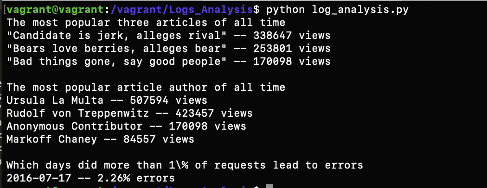

<h1>Log Analysis Project </h1>
	<h2>Create a reporting that print out the data in the database</h2>

<h1>Introduction</h1>

Using python to work with data that could have come from a real-world web application, with fields representing information that a web server would record, such as HTTP status codes and URL paths. The web server and the reporting tool both connect to the same database, allowing information to flow from the web server into the report

<h3>The database includes three tables:</h3>
<ul>
	<li>The <b>authors</b> table includes information about the authors of articles.
	<li>The <b>articles</b> table includes the articles themselves.
	<li>The <b>log</b> table includes one entry for each time a user has accessed the site.
</li>

<h3>The reporting includes three main parts </h3>
<ol start="1">
	<li><b>What are the most popular three articles of all time? </b>Which articles have been accessed the most? Present this information as a sorted list with the most popular article at the top</li>
	<li><b>Who are the most popular article authors of all time? </b>That is, when you sum up all of the articles each author has written, which authors get the most page views? Present this as a sorted list with the most popular author at the top.</li>
	<li><b>On which days did more than 1% of requests lead to errors?</b> The log table includes a column status that indicates the HTTP status code that the news site sent to the user's browser</li>
</ol>

<h3>In log_analysis.py functionailty</h3>
<ul>
	<li><b>psycopg2.connect("dbname= newdata.sql"):</b> Connect to PostgreSQL database and return a database connection</li>
	<li><b>display_top_three_popular_articles():</b> print the most popular three articles of all time</li>
	<li><b>display_most_popular_article_author():</b> print the most popular article authors of all time</li>
	<li><b>display_request_lead_to_errors():</b> print which day did more than 1% of requests lead to errors</li>
</ul>

<h1>Instruction how to virtual machine and download the data</h1>
<ol start="1">
	<li>Install VirtualBox</li>
		
VirtualBox is the software that actually runs the virtual machine. <a href="https://www.virtualbox.org/wiki/Download_Old_Builds_5_1">You can download it from virtualbox.org, here</a>. Install the platform package for your operating system. You do not need the extension pack or the SDK. You do not need to launch VirtualBox after installing it; Vagrant will do that.

	<li>Install Vagrant</li>
		
Vagrant is the software that configures the VM and lets you share files between your host computer and the VM's filesystem. <a href="https://www.vagrantup.com/downloads.html">Download it from vagrantup.com</a>. Install the version for your operating system.

	<li>Start the virtual machine</li>
		
From your terminal, inside the vagrant subdirectory, run the command vagrant up. This will cause Vagrant to download the Linux operating system and install it. This may take quite a while (many minutes) depending on how fast your Internet connection is.

		
When vagrant up is finished running, you will get your shell prompt back. At this point, you can run vagrant ssh to log_analysis in to your newly installed Linux VM!

	<li>Logged in!</li>
		
If you are now looking at a shell prompt that starts with the word vagrant (as in the above screenshot), congratulations — you've gotten logged into your Linux VM.

	<li>Loggin out and in</li>
		
If you type exit (or Ctrl-D) at the shell prompt inside the VM, you will be logged out, and put back into your host computer's shell. To log back in, make sure you're in the same directory and type vagrant ssh again.

		
If you reboot your computer, you will need to run vagrant up to restart the VM.

	<li>Run Module</li>
		
<b>python log_analysis.py</b>

</ol>

<h4>Output</h4>

