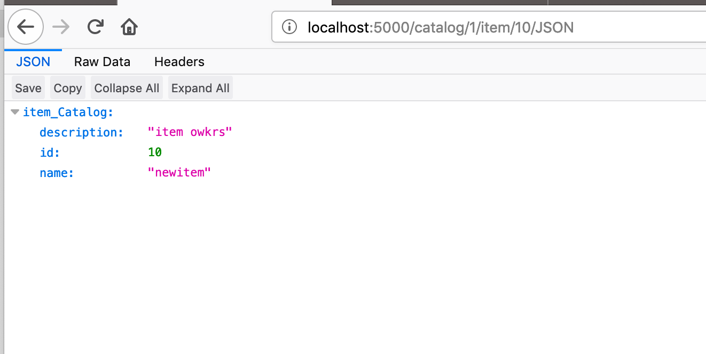
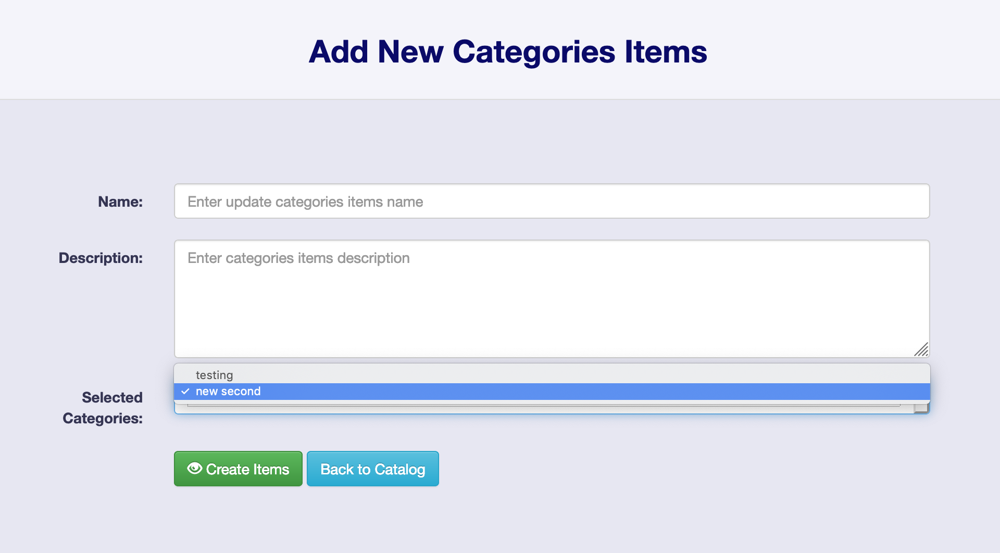
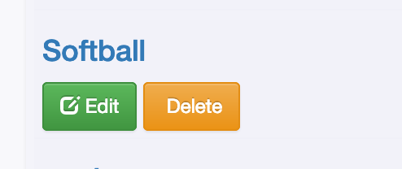

<h1>ITEM CATALOG</h1>

<h3>Project Description</h3>

In this project, you will be developing a web application that provides a list of items within a variety of categories and integrate third party user registration and authentication. Authenticated users should have the ability to post, edit, and delete their own items.
You will be creating this project essentially from scratch, no templates have been provided for you. This means that you have free reign over the HTML, the CSS, and the files that include the application itself utilizing Flask.

<h1>Instruction how to virtual machine and download the data</h1>
<ol start="1">
    <li>Install VirtualBox</li>
        
VirtualBox is the software that actually runs the virtual machine. <a href="https://www.virtualbox.org/wiki/Download_Old_Builds_5_1">You can download it from virtualbox.org, here</a>. Install the platform package for your operating system. You do not need the extension pack or the SDK. You do not need to launch VirtualBox after installing it; Vagrant will do that.

    <li>Install Vagrant</li>
        
Vagrant is the software that configures the VM and lets you share files between your host computer and the VM's filesystem. <a href="https://www.vagrantup.com/downloads.html">Download it from vagrantup.com</a>. Install the version for your operating system.

    <li>Start the virtual machine</li>
        
From your terminal, inside the vagrant subdirectory, run the command vagrant up. This will cause Vagrant to download the Linux operating system and install it. This may take quite a while (many minutes) depending on how fast your Internet connection is.

        
When vagrant up is finished running, you will get your shell prompt back. At this point, you can run vagrant ssh to log_analysis in to your newly installed Linux VM!

</ol>

<h1> Programming Languages Use in this project</h1>
<ul>
    <li>HTML</li>
    <li>CSS</li>
    <li>Javascript</li>
    <li>Bootstrap</li>
    <li>Python</li>
    <li>Flask</li>
    <li>SQLAchemy</li>
    <li>OAuth</li>
    <li>Google login </li>
</ul>

<h1>How to run the program</h1>
<ol start="1">
    <li> Follow the instruction above to download the VirtualBox and Vagrant</li>
    <li> Clone the <a href="https://github.com/udacity/fullstack-nanodegree-vm">fullstack-nanodegree-vm </a> </li>
    <li> Launch the Vagrant VM (vagrant up)</li>
    <li> Type vagrant ssh </li>
    <li> After ssh, type cd /vagrant</li>
    <li> cd item_Catalog </li>
    <li> python database_setup.py </li>
    <li> python insert_testing_db.py</li>
    <li> python itemCatalogApplication.py </li>
    <li> open the browser and type http://localhost:5000</li>
    <li> use Google Login credential to login and start adding categories and items </li>
</ol>

<h1> How to run JSON </h1>
<ol start="1">
    <li>http://localhost:5000/catalog/JSON - Return all Catalogs in JSON</li>
     
    <li>http://localhost:5000/catalog/2/item/JSON - Return all specific Item catalog in JSON</li>
     
    <li>http://localhost:5000/catalog/1/item/10/JSON - Return all Item depend on specific Categories in JSON</li>
    
    <li>http://localhost:5000/catalog/showJSONCatalog - Return all Catalogs in JSON</li>
    
</ol>

<h1>RESTful Web with CRUD </h1>
<h2>CRUD: READ </h2>
<ul>
    <li>http://localhost:5000/catalog/ without login </li>
    
</ul>

<h2>CRUD: CREATE</h2>
<ul>
    <li>Login with Google Credential</li>
    
    
    
    
</ul>

<h2>CRUD: UPDATE </h2>
<uL>
    <li>Update either Categories or Items</li>
    
    
</uL>

<h2>CRUD: DELETE </h2>
<ul>
    <li>Delete either Categories or Items </li>
    
    

</ul>

